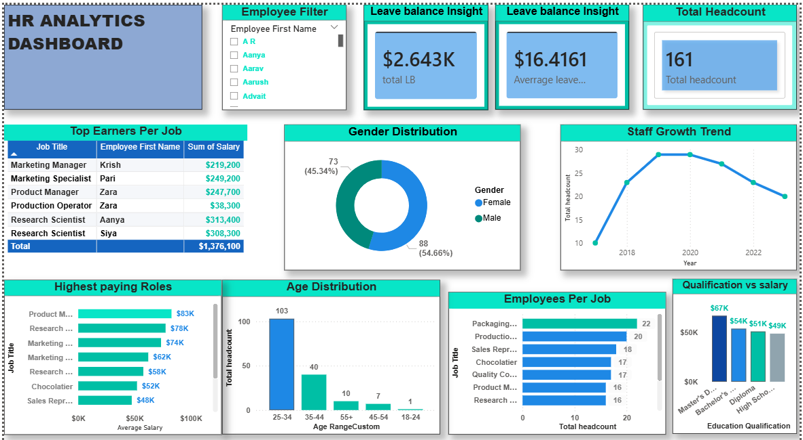

HR Analytics Dashboard 📊

📌 Overview

This project is an interactive HR Analytics Dashboard built to analyze and visualize employee data. It provides insights into workforce composition, salary distribution, and organizational trends.

🎯 Objectives

- Analyze employee demographics
- Track salary distribution across roles
- Monitor leave balances and trends
- Identify top-performing and high-earning employees
- Understand workforce growth over time

📊 Key Features

- Employee Filter: Allows dynamic selection of employees
- Leave Insights: Displays total and average leave balance
- Top Earners per Job: Highlights highest-paid employees by role
- Gender Distribution: Visual breakdown of male vs female employees
- Staff Growth Trend: Tracks employee count over time
- Age Distribution: Shows workforce age segmentation
- Employees per Job Role: Compares headcount across roles
- Qualification vs Salary: Analyzes how education impacts salary
- Highest Paying Roles: Displays roles with top average salaries

🛠️ Tools Used

- Power BI
- Excel (for data preparation)

📂 Dataset

The dataset includes employee information such as:

- Name
- Job Title
- Salary
- Age
- Gender
- Education Qualification
- Leave Balance

🚀 How to Use

1. Open the Power BI file (.pbix)
2. Interact with filters and visuals
3. Explore insights across different HR metrics

# Dashboard Preview

📈 Insights You Can Derive

- Which roles earn the most
- Gender balance in the organization
- Workforce growth trends
- Age group distribution
- Relationship between education and salary
